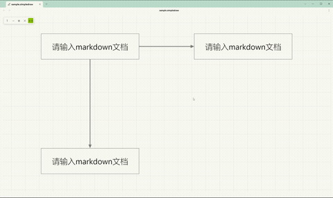
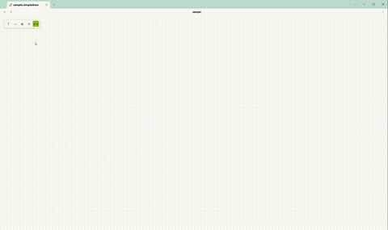
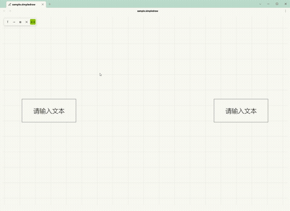

# SimpleDraw

轻量级流程图绘制软件，在 SimpleDraw 中直接创建和编辑 `.simpledraw` 文件。<br>
A lightweight flowchart drawing app. Create and edit `.simpledraw` files directly in Obsidian.


> 🖥️ 不想用独立桌面版?**obsidian插件已发布！**   
> 🖥️ Don't want to use a standalone desktop app? **The Obsidian plugin has been released!**
> 🔗 https://community.obsidian.md/plugins/simple-draw

---

## 使用教程
## Usage Guide

### 画板操作
### Canvas

 

**移动**：鼠标中键拖拽<br>
**Pan**: Middle-click drag

**缩放**：Ctrl + 鼠标滚轮<br>
**Zoom**: Ctrl + scroll wheel

### 文本框
### Textbox



1. 点击左上角 **T** 按钮，在画板点击两次确定位置。<br>
   Click the **T** button, then click twice on the canvas to place a textbox.
2. 双击文本框打开编辑器。<br>
   Double-click a textbox to open its editor.
3. 拖拽四角调整大小。<br>
   Drag the corners to resize.
4. **锁定**：编辑器菜单点击 🔒。**解锁**：右键文本框 →「解锁」。<br>
   **Lock**: Click 🔒 in the editor. **Unlock**: Right-click → "Unlock".

### 箭头
### Arrow



1. 点击左上角 **→** 按钮，在画板点击起点和终点。<br>
   Click the **→** button, then click start and end points on the canvas.
2. 端点可自动吸附文本框锚点，也可自由放置。<br>
   Endpoints auto-snap to anchors or remain free.
3. 吸附箭头自动跟随锚点移动。<br>
   Snapped arrows automatically follow anchor movement.
4. **双击箭头**弹出菜单：<br>
   **Double-click an arrow** to open its menu:
   - 首尾箭头显隐切换
   - Start & End arrow toggle
   - 实线/虚线切换
   - Solid & Dashed toggle
   - **T** 文字标签开关
   - Label toggle
   - 删除
   - Delete
5. 方向可通过菜单选择或键盘方向键 **←↑↓→** 切换。<br>
   Direction can be set via the menu or arrow keys.

### 文字标签
### Arrow Label

双击箭头 → 点击 **T** 按钮 → 箭头中点出现可编辑文字，支持 Markdown，自动跟随箭头移动。<br>
Double-click an arrow → click **T** → an editable label appears at the midpoint. Supports Markdown and auto-follows the arrow.

开关隐藏/显示（保留内容）。空内容时画布显示灰色提示「请输入 markdown 文本」。<br>
Toggle to hide/show (content is preserved). Shows a placeholder when empty.

### 选择与编辑
### Selection & Editing

**选择**：单击 / Ctrl+单击多选 / 拖拽框选。<br>
**Select**: Click / Ctrl+click / drag box select.<br>
**复制粘贴**：Ctrl+C / Ctrl+V，支持跨文件。<br>
**Copy/Paste**: Ctrl+C / Ctrl+V, cross-file support.<br>
**外部文本**：复制文字后到画板 Ctrl+V 自动创建文本框。<br>
**External Text**: Paste external text on canvas to create a textbox.<br>
**删除**：选中后按 Delete。<br>
**Delete**: Select and press Delete.<br>
**撤销**：Ctrl+Z。<br>
**Undo**: Ctrl+Z.<br>
**重做**：Ctrl+Shift+Z。<br>
**Redo**: Ctrl+Shift+Z.

### 锚点方案
### Anchor Scheme

在设置面板「吸附功能」中切换：<br>
Switch in Settings → Snap:

- **方案一 Scheme 1（默认）**：8 锚点（4 角点 + 4 边中点）。8 anchors (4 corners + 4 midpoints).
- **方案二 Scheme 2**：12 锚点（4 边中点 + 8 四分点），仅被箭头连接的四分点参与吸附。12 anchors (4 midpoints + 8 quarter points), only connected quarter points participate in snap.

---

## 功能
## Features

### 文本框
### Textbox

| 功能 Feature | 说明 Description |
|-------------|-----------------|
| 形状 Shape | 矩形 / 椭圆 / 菱形 Rectangle / Ellipse / Diamond |
| 内容 Content | Markdown 渲染（支持数学公式、高亮等）Markdown rendering (math, highlight) |
| 填充 Fill | 开关切换，线框模式 Toggle, wireframe mode |
| 显隐 Visibility | 开关隐藏边框和填充 Hide border & fill |
| 文字方向 Writing Mode | 横排 / 竖排 Horizontal / Vertical |
| 文字对齐 Text Align | 水平（左/中/右）+ 垂直（上/中/下）Horizontal + Vertical |
| 字号 Font Size | A+ / A- / R 实时调整 Real-time adjustment |
| Markdown 快捷键 | Ctrl+B 加粗 / Ctrl+I 斜体 / Ctrl+U 删除线 / Ctrl+Shift+C 代码 / Ctrl+Shift+K 链接 / Ctrl+Shift+H 高亮 / Ctrl+Shift+M 行内公式 / Ctrl+Shift+Alt+M 行外公式 |
| 锁定 Lock | 🔒 锁定后不可编辑、移动、缩放、删除、选择、吸附 Prevents edit, move, resize, delete, select, snap |

### 箭头
### Arrow

| 功能 Feature | 说明 Description |
|-------------|-----------------|
| 路由 Routing | 正交避让（自动绕开文本框）Orthogonal obstacle avoidance |
| 吸附 Snap | 支持边中点 / 四分点锚点 Edge midpoint / quarter-point anchor |
| 形状 Shape | 实心三角 / 空心三角 / V 型 / 圆点 Triangle / Open Triangle / V-Shape / Circle |
| 端点控制 Endpoints | 首尾箭头独立显隐 Start/End arrow toggle |
| 线型 Line Style | 实线 / 虚线 Solid / Dashed |
| 方向 Direction | 菜单选择或键盘 ←↑↓→ Menu or arrow keys |
| 文字标签 Label | 箭头中点 Markdown 文字标签，自动跟随 Markdown label at path midpoint, auto-follows |

### 交互
### Interaction

| 功能 Feature | 说明 Description |
|-------------|-----------------|
| 画板 Canvas | 中键平移，Ctrl+滚轮缩放 Middle-click pan, Ctrl+scroll zoom |
| 选取 Selection | 单击 / Ctrl+单击多选 / 拖拽框选 Click / Ctrl+click multi / drag box select |
| 移动 Move | 拖拽文本框 Drag textbox |
| 缩放 Resize | 拖拽四角 Drag corners |
| 吸附对齐 Alignment Snap | 拖拽时对齐边线（多优先级系统）Snap to edges with priority system |
| 调整大小吸附 Resize Snap | 角点拖拽时对齐边线 Corner drag snap to edges |
| 锚点方案 Anchor Scheme | 8 锚点 / 12 锚点 8 anchors / 12 anchors |
| 撤销/重做 Undo/Redo | Ctrl+Z / Ctrl+Shift+Z，最多 100 步 Up to 100 steps |
| 复制/粘贴 Copy/Paste | Ctrl+C/V 跨文件，外部纯文本自动创建文本框 Cross-file, external text → textbox |

### 右键菜单
### Context Menu

文本框置顶 / 置底。解锁文本框。<br>
Bring to Front / Send to Back. Unlock textbox.

### 导出
### Export

**PNG 导出** — DOM 截图，所见即所得，保留数学公式和代码块。<br>
DOM screenshot, WYSIWYG, preserves math & code blocks.

选项：网格 / 透明背景。<br>
Options: Grid / Transparent background.

### 多语言
### i18n

中文 / English — 设置面板一键切换。<br>
One-click switch in settings.

---

## 安装
## Installation

1. 下载 `main.js`、`manifest.json`、`styles.css`。<br>
   Download `main.js`, `manifest.json`, `styles.css`.
2. 复制到 `.obsidian/plugins/simple-draw/`。<br>
   Copy to `.obsidian/plugins/simple-draw/`.
3. 在 Obsidian 设置中启用插件。<br>
   Enable the plugin in Obsidian settings.
4. 在文件夹上右键 →「插入 SimpleDraw」新建 `.simpledraw` 文件。<br>
   Right-click a folder → "Insert SimpleDraw" to create a `.simpledraw` file.

---

## 设置
## Settings

| 设置项 Setting | 说明 Description |
|--------------|-----------------|
| 语言 Language | 中文 / English |
| 显示画板纹路 Show Grid | 网格背景 Grid background |
| 箭头线粗细 Arrow Stroke Width | 1-5px |
| 箭头大小 Arrow Head Size | 6-20px |
| 箭头形状 Arrow Shape | 实心三角 / 空心三角 / V 型 / 圆点 Triangle / Open Triangle / V-Shape / Circle |
| 显示箭头连接点 Show Anchor Dots | 箭头端点小圆点标记 Dot markers at arrow endpoints |
| 默认字号 Default Font Size | 新文本框默认字号 8-72px |
| 锚点方案 Anchor Scheme | 8 锚点 / 12 锚点 8 anchors / 12 anchors |
| 吸附预览圆圈大小 Snap Preview Radius | 箭头插入模式吸附预览圆圈 4-20px |
| 吸附对齐 Snap Enabled | 开启/关闭 On/Off |
| 快捷键 Shortcuts | 自定义 Markdown 格式快捷键 Custom Markdown shortcuts |

---

## 技术架构
## Architecture

```
src/
├── main.ts          入口 — 注册视图、命令、功能区、文件菜单、设置选项卡
                     Plugin entry: register view, commands, ribbon, file menu, settings tab
├── view.ts          视图层 — DOM、事件、渲染循环、编辑器、PNG 导出
                     View layer: DOM, events, render loop, editors, PNG export
├── engine.ts        核心引擎 — 选择、历史记录、坐标变换、吸附、箭头路由
                     Core engine: selection, history, transforms, snap, arrow routing
├── types.ts         数据类型 — 枚举、常量
                     Data types: enums, constants
├── settings.ts      设置接口 — 默认值
                     Settings interface: defaults
├── settingsTab.ts   设置选项卡 UI
                     Settings tab UI
└── locale.ts        国际化 — 中文 / English
                     i18n: Chinese / English
```

---

## 许可
## License

MIT
